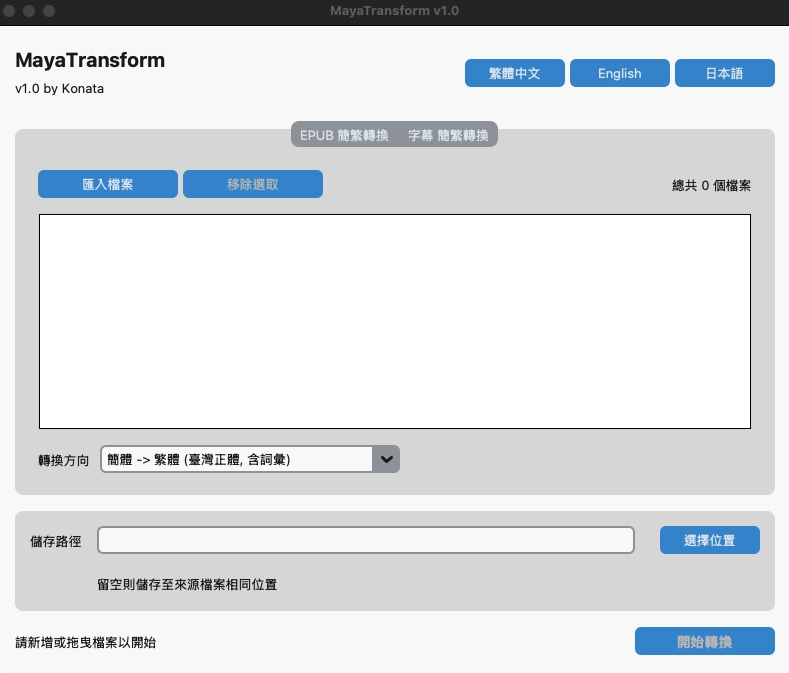

# MayaTransform
一個使用 Python 和 CustomTkinter 製作的桌面應用程式，專門用於 EPUB 電子書和 SRT/ASS 字幕的簡繁體中文轉換。

## 功能特色
-   支援 EPUB 和 SRT/ASS 檔案格式。
-   提供「簡轉繁」與「繁轉簡」兩種轉換模式。
-   支援批次處理多個檔案。
-   提供檔案拖放功能，操作直觀。
-   支援多國語言介面 (繁中、英文、日文)。

## 應用程式預覽

### 中文

### 英文

### 日文


## 如何使用
# 專案安裝指南

## 步驟 1：取得專案

首先，將本專案複製到您的本機電腦。

### 推薦方式 (使用 Git)
打開您的終端機，執行以下指令：
```bash
git clone [專案的GIT網址]
cd [專案資料夾名稱]
```

### 替代方式 (下載 ZIP)
1. 點擊頁面上的 `Code` 按鈕，然後選擇 `Download ZIP`
2. 下載後解壓縮，並在終端機中 `cd` 進入該資料夾

## 步驟 2：設定環境與安裝套件

我們強烈建議使用虛擬環境來隔離專案所需的套件，避免與系統全域環境衝突。

### 1. 建立虛擬環境
在專案的根目錄下，執行以下指令來建立一個名為 `venv` 的虛擬環境：
```bash
# 建議使用 Python 3.8 或以上版本
python3 -m venv venv
```

### 2. 啟用虛擬環境

**Windows (使用 Command Prompt 或 PowerShell):**
```cmd
venv\Scripts\activate
```

**macOS / Linux:**
```bash
source venv/bin/activate
```

> 成功啟用後，您會在終端機的提示符號前看到 `(venv)` 字樣

### 3. 安裝所有必要的套件
確保您已在虛擬環境 `(venv)` 中，然後執行：
```bash
pip install -r requirements.txt
```

## 步驟 3：執行程式

完成上述設定後，您就可以透過對應的腳本來啟動程式。

### 💻 Windows 使用者
直接用滑鼠**雙擊**專案中的 `run.bat` 檔案即可。

### 🐧 macOS / Linux 使用者
您需要先賦予腳本執行的權限，此為**一次性動作**。

1. **賦予權限 (僅需做一次):**
```bash
chmod +x run.sh
```

2. **執行腳本:**
```bash
./run.sh
```

## 技術需求
- Python 3.8 或以上版本

## 使用的套件
-   CustomTkinter
-   opencc-python-reimplemented
-   ebooklib
-   beautifulsoup4
-   tkinterdnd2-universal